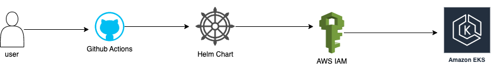

# K8 Helm Test

This is a Micro-service based application that will:

- Setup an EKS Cluster on AWS
- Build a Python Docker Image
- Deploy image to the EKS Cluster using a Helm Chart

## Setup an EKS Cluster on AWS

Terraform is used to Setup the Kubernetes Cluster, on AWS. It will first setup the network sytem, the VPC, NAT, Subnets and all the system requires to run the Kubernetes cluster and applications within the infrastructure.

The terraform code is located in the `eks-infra` directory. The workflow to deploy this is to use

```hcl
terraform init
terraform apply -auto-approve 
```

There is also a workflow that can be used, when the `.github/workflows/eks.yml` file. When a push is made to the `eks` branch, the pipeline will be automatically triggered to run the terraform scripts for infrastructure deployment

## Build a Python Docker Image

The `app/` directory contain the python application with flask module to server as the webserver. It also contains the `Dockerfile` which is used to build the Docker image. The Docker image is built based on the configurations of the Dockerfile. It uses a python:apline based image for optimal image that is small enough and has all the necessary pre-requisite for the application to run.

## Deploy image to the EKS Cluster using a Helm Chart

A deployment is automatically triggered whenever a push is done to the Github `main` branch. The application is deployed using Github actions.  `.github/workflows/app-deploy.yml` is the pipeline configuration. The pipeline has the following steps/actions:

- Checkout code
- Setup Docker CLI
- Authenticate with Docker Registry
- Build the Docker image and push to Docker registry (using a unique tag)
- Configure AWS credentials for authorization and authentication
- Install Helm Binary
- Authorize for Kubernetes and deploy via the helm chart in `app/k8s/appchart`

### Notes

- A private Docker registry was created before the image was built and pushed to it.

## Security Features in Setup

- Docker image is stored in a private repository in Dockerhub making the image not accessible over the internet
- Alpine base image was used to build the Docker image making it a slim image, therefore reducing the surface area of attack
- The Pod configuration has a `securityContext` that protects it against container privilege escalation
- The credentials used for `terraform` and Github Actions deployment are stored in Github secrets
- VPC/Network configuration has a public and private subnet. Private subnet helps to protect the worker nodes from public internet access

## Monitoring

Loki stack (Promtail, Loki, Grafana) was deployed in the cluster for collection logs. The official helm chart of Loki was used to deploy it, with the following commands:

```bash
helm repo add grafana https://grafana.github.io/helm-charts
helm upgrade --install loki --namespace=loki-stack grafana/loki-stack --set grafana.enabled=true
```

- Promtail will collect logs from containers
- Loki will store the log data in its time-series database
- Grafana does the query and visualization of data stored in Loki

## Microservice URL

The application is available on the following URL: [Click Here](a98504ead9cda463385bb1ec0d147553-896652980.eu-west-1.elb.amazonaws.com)

(c) 2023 Ewere
